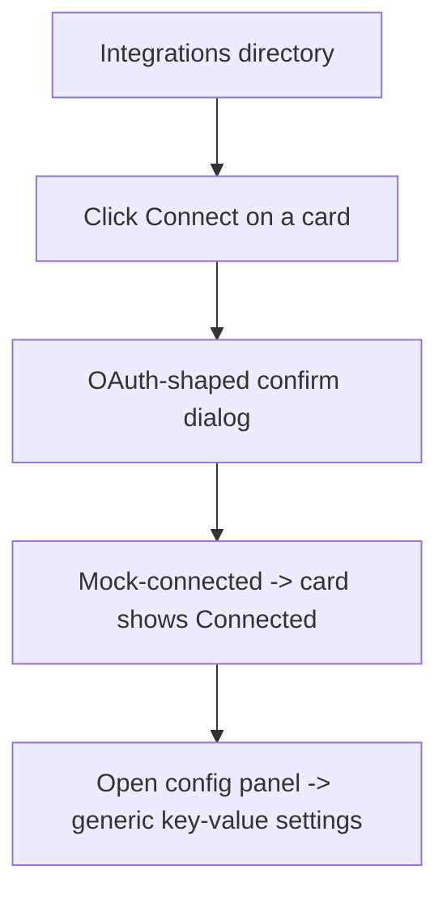
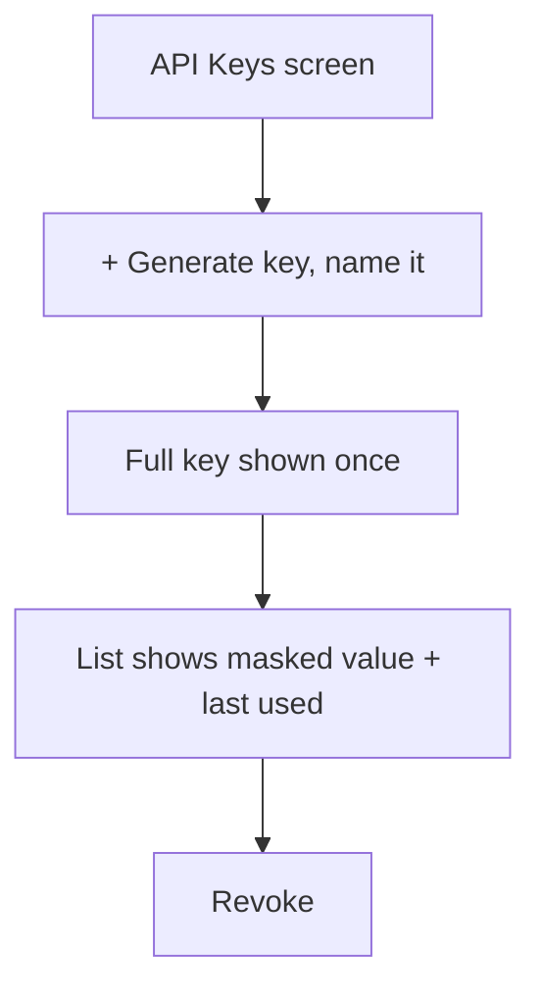

# Step 2 — User Flow — Integrations

## Flow A — Connect an integration



## Flow B — Webhooks

```mermaid
flowchart TD
    A[Webhooks screen] --> B[+ Add webhook: URL, name, event types]
    B --> C[Signing secret shown once]
    C --> D[Delivery log (mock) + disable/delete]
```

## Flow C — API keys



## Carried into Step 3 (Sitemap)

Integrations directory, per-integration config panel, Webhooks screen, API Keys screen.
