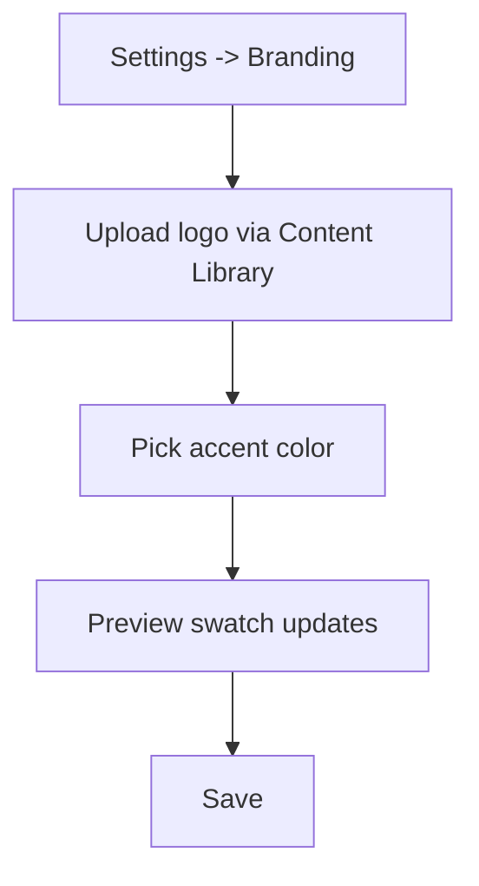
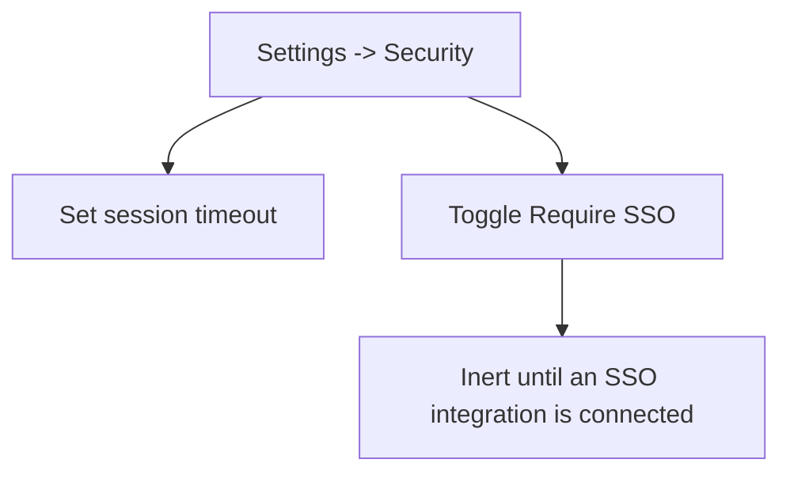
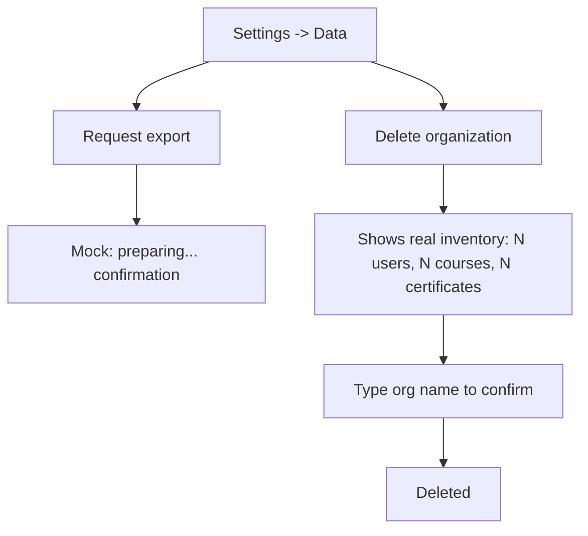

# Step 2 — User Flow — Full Settings

## Flow A — Branding

## Flow B — Security

## Flow C — Data export & deletion

## Carried into Step 3 (Sitemap)

Branding tab, Security tab, Data tab (export + delete-org confirm).
