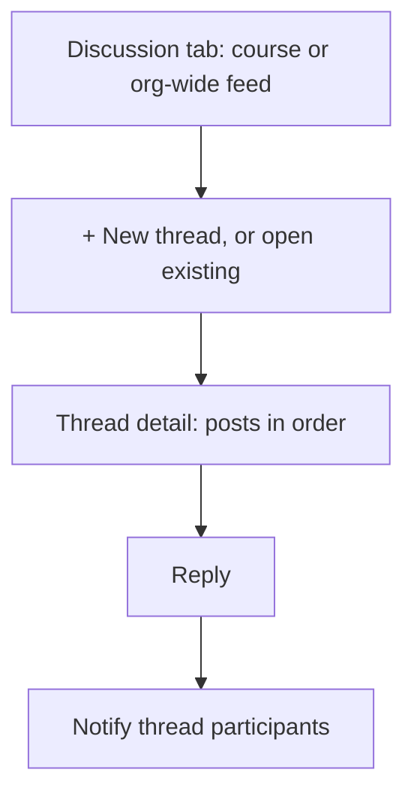
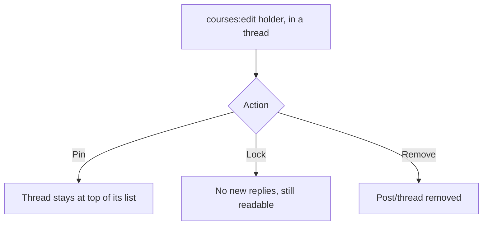
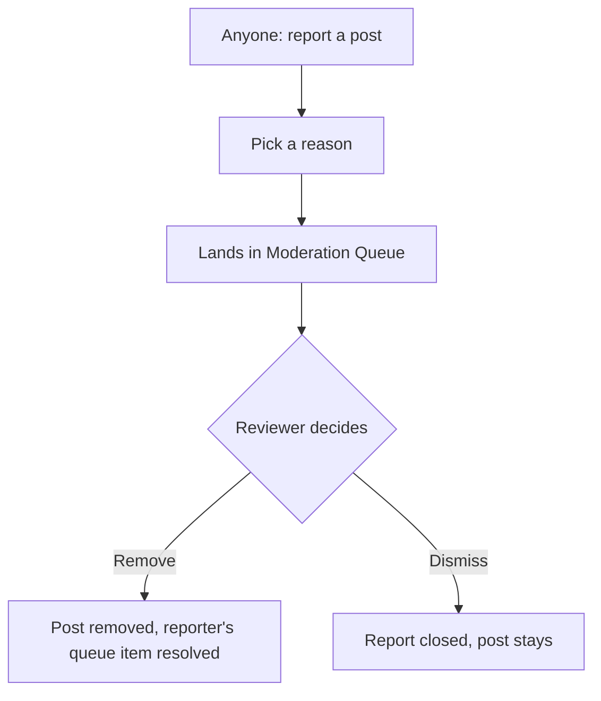

# Step 2 — User Flow — Communities

## Flow A — Post and reply

## Flow B — Moderate

## Flow C — Report

## Carried into Step 3 (Sitemap)

Course Discussion tab, org-wide Community feed, Thread detail, Moderation Queue, Report dialog.
